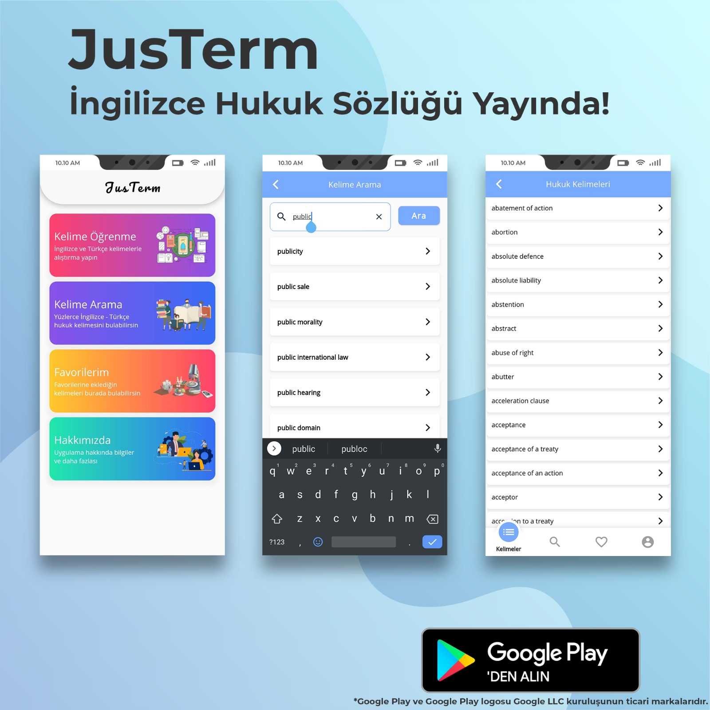

[![GPL v3 License][license-shield]][license-url]
[![LinkedIn][linkedin-shield]][linkedin-url]

<!-- PROJECT LOGO -->
 

  

  <h3 align="center">	JusTerm - İngilizce Hukuk Sözlüğü</h3>
 
  

<!-- TABLE OF CONTENTS -->
## Table of Contents

* [About the Project](#about-the-project)
  * [Built With](#built-with)
* [Getting Started](#getting-started)
  * [Prerequisites](#prerequisites)
* [Roadmap](#roadmap)
* [License](#license)
* [Contact](#contact)

<!-- ABOUT THE PROJECT -->
## About The Project

[![JusTerm - İngilizce Hukuk Sözlüğü][product-screenshot]](https://merttoptas.com)

JusTerm is a glossary of legal terms developed by a Law School student to assist legal people.

With JusTerm, you can practice vocabulary learning, keep words in your favorite lists.

### Built With
This section should list any major frameworks that you built your project using. Here are a few examples.
* [Provider](https://pub.dev/packages/provider/)
* [Algolia](https://www.algolia.com/)
* [Http ](https://pub.dev/packages/http)
* [Floor Database](https://pub.dev/packages/floor/)
* [Firebase](https://firebase.google.com)
* [Admob Flutter](https://pub.dev/packages/admob_flutter)
* [Cloud Firestore](https://pub.dev/packages/cloud_firestore)

<!-- GETTING STARTED -->
## Getting Started

This project is a starting point for a Flutter application.

A few resources to get you started if this is your first Flutter project:

Lab: Write your first Flutter app
For help getting started with Flutter, view our online documentation, which offers tutorials, samples, guidance on mobile development, and a full API reference.

### Prerequisites

<!-- ROADMAP -->
## Roadmap

See the [open issues](https://github.com/merttoptas/engtrhukuksozluk/issues) for a list of proposed features (and known issues).

<!-- LICENSE -->
## License

Distributed under the GPL v3 License. See `LICENSE` for more information.
     

 
  <h5 align="center">	 GNU LESSER GENERAL PUBLIC LICENSE  </h3>
   <h5 align="center">	 Version 3, 29 June 2007 </h3>

  

 Copyright (C) 2007 Free Software Foundation, Inc. <https://fsf.org/>
 Everyone is permitted to copy and distribute verbatim copies
 of this license document, but changing it is not allowed.

  This version of the GNU Lesser General Public License incorporates
the terms and conditions of version 3 of the GNU General Public
License, supplemented by the additional permissions listed below.

<!-- CONTACT -->
## Contact

Mert Toptaş- [@merttoptas](https://twitter.com/merttoptas) 

Project Link: [engtrhukuksozluk](https://github.com/merttoptas/engtrhukuksozluk)

Google Play:  [Google Play](https://play.google.com/store/apps/details?id=com.merttoptas.engtrhukuksozluk)

<!-- MARKDOWN LINKS & IMAGES -->
<!-- https://www.markdownguide.org/basic-syntax/#reference-style-links -->
[contributors-shield]: https://img.shields.io/github/contributors/othneildrew/Best-README-Template.svg?style=flat-square
[license-shield]: https://img.shields.io/cran/l/devtools?style=flat-square
[license-url]: https://github.com/merttoptas/engtrhukuksozluk/blob/master/LICENSE
[linkedin-shield]: https://img.shields.io/badge/-LinkedIn-black.svg?style=flat-square&logo=linkedin&colorB=555
[linkedin-url]: https://linkedin.com/in/mertcantoptas
[product-screenshot]: images/logo.jpg
